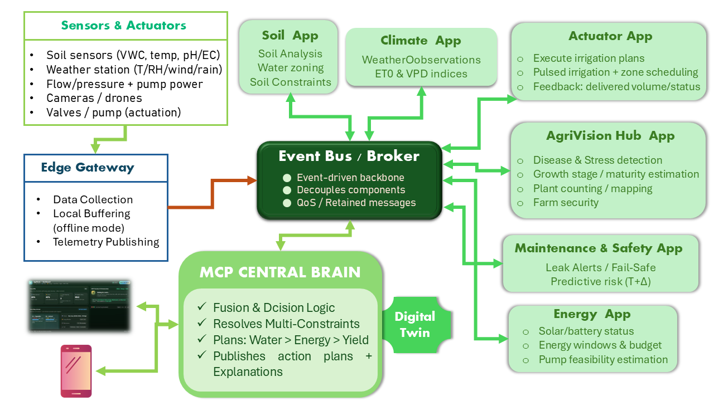

# AgriBrain Smart Farming Prototype

## Overview

AgriBrain is a smart farming prototype that demonstrates how **IoT data**, **AI models**, **central orchestration**, **digital simulation**, and **automated actions** can work together in a single agricultural decision pipeline.

The prototype simulates a smart agriculture environment where data are collected from multiple sources:

- soil sensors
- weather and energy monitoring nodes
- drone crop images

These inputs are processed by specialized applications and combined into a final operational decision.

This project demonstrates a simplified but functional architecture integrating **AI (Huawei MindSpore)** with **IoT-style data routing and orchestration**.

---

# System Components

## Gateway
Receives incoming packets from simulated sensors and forwards them to the broker.

## Broker
Routes packets to the correct specialized applications.

Routing logic used in the prototype:

- `soil` → Soil App  
- `energy_climate` → Climate App + Energy App  
- `vision` → AgriVision App  

## Soil App
Analyzes soil chemistry data and predicts whether the soil is:

- **Fertile**
- **Not Fertile**

This module uses a **MindSpore model** trained on a soil fertility dataset.

## Climate App
Analyzes weather conditions relevant to irrigation, including:

- temperature
- humidity
- cloud cover
- rain forecast

## Energy App
Evaluates energy availability for irrigation based on:

- solar irradiance
- wind speed
- battery level

## AgriVision App
Analyzes crop images captured by a simulated drone and predicts:

- **Healthy**
- **Diseased**

This module uses a **MindSpore image classification model**.

## MCP Central Brain
Central orchestration module that combines outputs from all specialized apps and generates the final decision.

## Digital Twin
Simulates the selected decision before execution to estimate feasibility and risk.

## Actuator App
Transforms the validated decision into executable actions such as irrigation activation or scheduling.

---

# Huawei Technology Integration

Huawei **MindSpore** is used in AI module:

- **Soil App** → Soil fertility prediction  

Huawei **ModelArt & MindSpore** is used in AI module:
- **AgriVision App** → Crop image classification

These models are trained locally and loaded during prototype execution.

---

# Requirements

Recommended environment:

- Python **3.10+**
- MindSpore
- NumPy
- Pandas
- scikit-learn
- Pillow
- rich

Install dependencies:

pip install mindspore numpy pandas scikit-learn pillow rich

---

# Reproducing the Prototype

Follow the steps below to reproduce the prototype and obtain the same results.

---

## 1. Download the Project

Clone or download the repository and open a terminal inside the project folder:

agribrain_prototype/

---

## 2. Prepare the Data

Ensure the following files exist.

### Soil Dataset

data/soil_fertility.csv

### Soil Packet

data/soil_sensor_data.json

### Weather / Energy Packet

data/weather_energy_data.json

### Vision Dataset

data/vision_dataset/
├── train/
│ ├── healthy/
│ └── diseased/
├── val/
│ ├── healthy/
│ └── diseased/
└── test/
├── healthy/
└── diseased/

### Vision Sample

data/vision_samples/sample_test.jpg

---

## 3. Train the Soil Model

Run:

python models/soil_train.py

This generates:

models/soil_model.ckpt
models/soil_scaler.json

---

## 4. Train the AgriVision Model

Run:

python models/agrivision_train.py

This generates:

models/agrivision_model.ckpt
models/vision_labels.json

---

## 5. Run the Prototype

Execute the main pipeline:

python main.py

---

# Execution Flow

When `main.py` runs, the following steps occur:

1. Input packets are loaded
2. Packets are received by the gateway
3. The broker routes packets to the correct apps
4. Each specialized app performs analysis
5. Results are grouped for the MCP Central Brain
6. MCP generates the final decision
7. Digital Twin simulates the decision
8. Actuator executes or schedules actions

---

# Expected Results

A typical execution may produce:

| Module | Result |
|------|------|
| Soil App | Fertile |
| Climate App | Hot and dry conditions |
| Energy App | Sufficient energy |
| AgriVision App | Healthy |
| MCP Decision | Irrigate now |
| Digital Twin | Feasible with low risk |
| Actuator | Irrigation pump activated |

---

# Re-running the Prototype

After models are trained once, the prototype can be executed repeatedly using:

python main.py

To test different scenarios, modify:

data/soil_sensor_data.json
data/weather_energy_data.json
data/vision_samples/sample_test.jpg

Then run the prototype again.

---

# Notes

This repository represents a **demonstration prototype**, not a full production system.

Some parts are intentionally simplified:

- simulated IoT packets instead of real sensors
- simplified MCP decision rules
- simplified Digital Twin simulation
- terminal interface instead of a full dashboard

Despite these simplifications, the prototype demonstrates a complete **AI + IoT smart agriculture pipeline**.

---

# Summary

AgriBrain demonstrates how agricultural data can move through a complete intelligent workflow:

**Data Collection → Analysis → Decision → Simulation → Action**

The prototype integrates:

- IoT-style data ingestion
- AI analysis with **Huawei MindSpore**
- centralized orchestration
- digital twin validation
- automated action execution